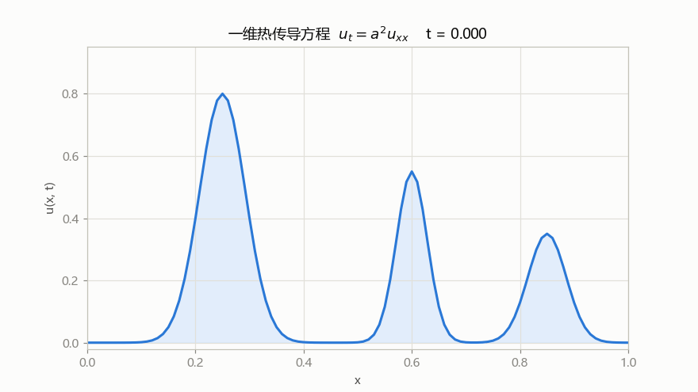
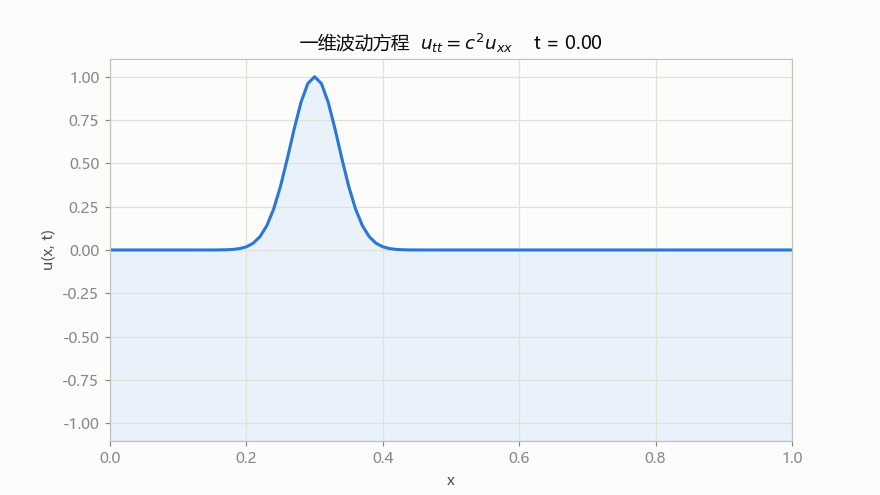
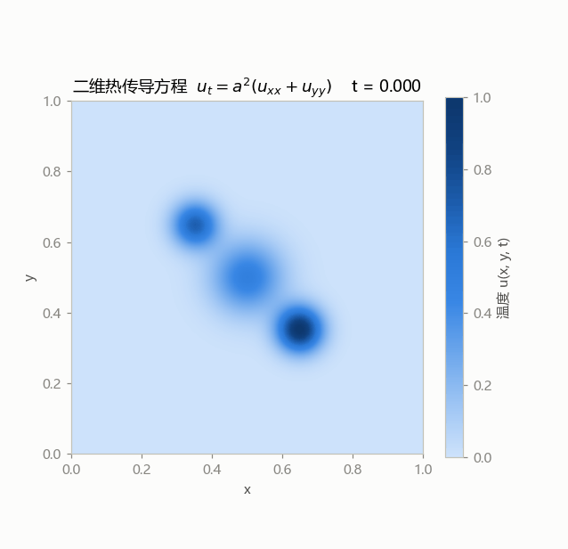

# PDE 可视化：经典偏微分方程动画

用 Python 实现的三个经典偏微分方程的数值解与动画演示，配合《数学物理方程》课程学习使用。

## 方程与动画

### 1. 一维热传导方程（扩散）

$$
u_t = a^2 u_{xx}, \qquad u(0,t) = u(1,t) = 0
$$

三个高斯"热包"随时间逐渐抹平——直观展示扩散过程。



### 2. 一维波动方程

$$
u_{tt} = c^2 u_{xx}, \qquad u(0,t) = u(1,t) = 0
$$

初始高斯波包（初速度为零）分裂成两个行波，观察其在固定端点处的**反射与相位翻转**。



### 3. 二维热传导方程

$$
u_t = a^2 (u_{xx} + u_{yy}), \qquad u|_{\partial\Omega} = 0
$$

三个高斯热斑在正方形区域内的扩散（热图动画，色带从浅到深对应温度从低到高）。



## 数值方法

全部采用**显式有限差分格式（FTCS）**，可以看到差分格式的稳定性条件不是装饰：

| 方程 | 格式 | 稳定性条件 |
|---|---|---|
| 热传导（一维） | $u_i^{n+1} = u_i^n + r(u_{i+1}^n - 2u_i^n + u_{i-1}^n)$ | $r = \frac{a^2\Delta t}{\Delta x^2} \le \frac{1}{2}$ |
| 波动（一维） | $u_i^{n+1} = 2u_i^n - u_i^{n-1} + C^2(u_{i+1}^n - 2u_i^n + u_{i-1}^n)$ | $C = \frac{c\Delta t}{\Delta x} \le 1$（CFL 条件） |
| 热传导（二维） | 五点格式 | $r = \frac{a^2\Delta t}{\Delta x^2} \le \frac{1}{4}$ |

**动手实验**：把 `heat_1d.py` 里的 `r = 0.4` 改成 `r = 0.55`（违反稳定性条件），数值解会迅速发散爆炸——这是课本上"稳定性"最直观的解释。

## 运行

```bash
pip install -r requirements.txt
python src/heat_1d.py      # 一维热传导
python src/wave_1d.py      # 一维波动
python src/heat_2d.py      # 二维热传导
python src/poisson_1d.py   # 一维 Poisson（有限元学习项目）
```

动画输出到 `output/` 目录（GIF/PNG）。

## 目录结构

```
pde-visualization/
├── src/                # 代码
│   ├── heat_1d.py      #   一维热传导方程动画
│   ├── wave_1d.py      #   一维波动方程动画
│   ├── heat_2d.py      #   二维热传导方程动画
│   └── poisson_1d.py   #   一维 Poisson 有限元管线（学习中）
├── docs/               # 文档
│   ├── Git备忘录.md    #   Git 操作速查（没有 AI 也能自己上传）
│   ├── 学习记录.md     #   理论 → 代码的学习全过程
│   └── Question.md     #   提问与回答
├── output/             # 生成的 GIF/PNG
├── requirements.txt    # 依赖
└── README.md
```
